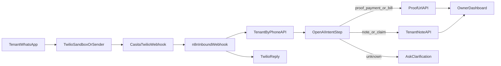

# WhatsApp Bot MVP

This document defines the spec-driven MVP flow for inbound tenant handling over WhatsApp.

## Goal

Allow tenants to send text or media on WhatsApp while Casita remains the source of truth for:
- tenant identity
- obligations
- proof status
- owner dashboard visibility

## Architecture boundary

- Twilio: inbound transport
- n8n: orchestration and intent routing
- OpenAI: lightweight intent classification
- Casita APIs: state changes and storage

n8n must not own canonical statuses or business rules.

## End-to-end flow



## Casita API contracts for n8n

### 1) Resolve tenant context

`GET /api/tenant-by-phone?number=whatsapp:+5491124720369`

Headers:
- `x-casita-secret: <N8N_WEBHOOK_SECRET>`

Response (200):
- `tenant`: basic contact identity
- `unit`: token and location context
- `obligations[]`: pending/upcoming/reminded/overdue items

### 2) Save proof from Twilio media URL

`POST /api/tenant/[token]/proof-url`

Headers:
- `x-casita-secret: <N8N_WEBHOOK_SECRET>`

Body:
```json
{
  "obligationId": "cmxxx",
  "mediaUrl": "https://api.twilio.com/2010-04-01/Accounts/AC.../Messages/MM.../Media/ME...",
  "contentType": "image/jpeg"
}
```

Behavior:
- validates media URL host (`twilio.com` / `twiliocdn.com`)
- downloads media using Twilio Basic Auth
- uploads to Supabase `proofs` bucket
- updates obligation to `proof_uploaded`
- notifies owner by email (best-effort)

### 3) Save text message/claim

`POST /api/tenant/[token]/note`

Headers:
- `x-casita-secret: <N8N_WEBHOOK_SECRET>`

Body:
```json
{
  "text": "se rompió la canilla de la cocina",
  "category": "reclamo"
}
```

Behavior:
- creates a `custom` obligation with:
  - `sourceType: n8n`
  - `status: pending`
  - `notes: <text>`

## Twilio webhook security

`POST /api/webhooks/twilio-whatsapp`:
- parses `application/x-www-form-urlencoded`
- validates `X-Twilio-Signature` using `TWILIO_AUTH_TOKEN`
- forwards JSON payload to `N8N_WHATSAPP_WEBHOOK_URL`
- includes `x-casita-secret` for downstream auth

## n8n workflow (MVP nodes)

1. **Webhook Trigger** (JSON from Casita webhook)
2. **HTTP Request** `GET /api/tenant-by-phone`
3. **OpenAI Chat/Responses** intent classification
4. **IF/Switch** by intent:
   - `proof_payment`, `bill_upload` -> `POST /api/tenant/[token]/proof-url`
   - `note`, `claim`, `question` -> `POST /api/tenant/[token]/note`
   - default -> clarification message
5. **Twilio send message** back to tenant

Importable template:
- `docs/n8n-whatsapp-bot-mvp.workflow.json`

## OpenAI intent schema (recommended)

Use structured output with:
- `intent`: `proof_payment | bill_upload | note | unknown`
- `obligationId`: nullable
- `category`: `reclamo | consulta | otro`
- `reply`: short tenant-facing response in Rioplatense Spanish

## E2E checklist

- [ ] Tenant number is resolved by `tenant-by-phone`
- [ ] Text-only note appears in owner dashboard
- [ ] Image proof sets obligation to `proof_uploaded`
- [ ] Unknown intent triggers clarification reply
- [ ] Invalid number returns `404` and safe reply
- [ ] Twilio media download failure returns controlled error
